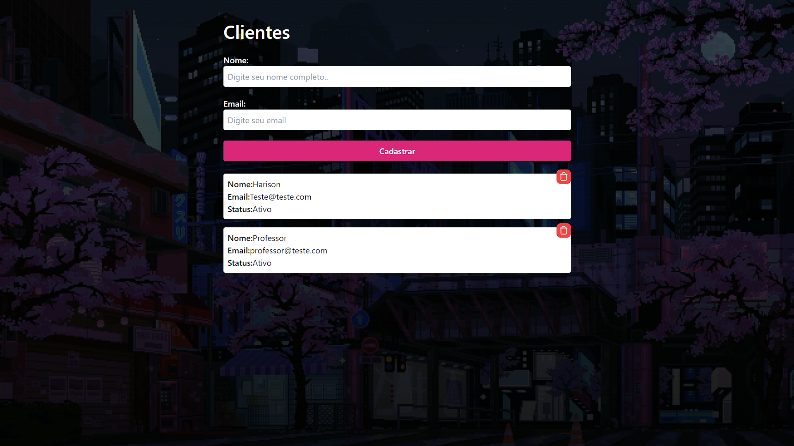
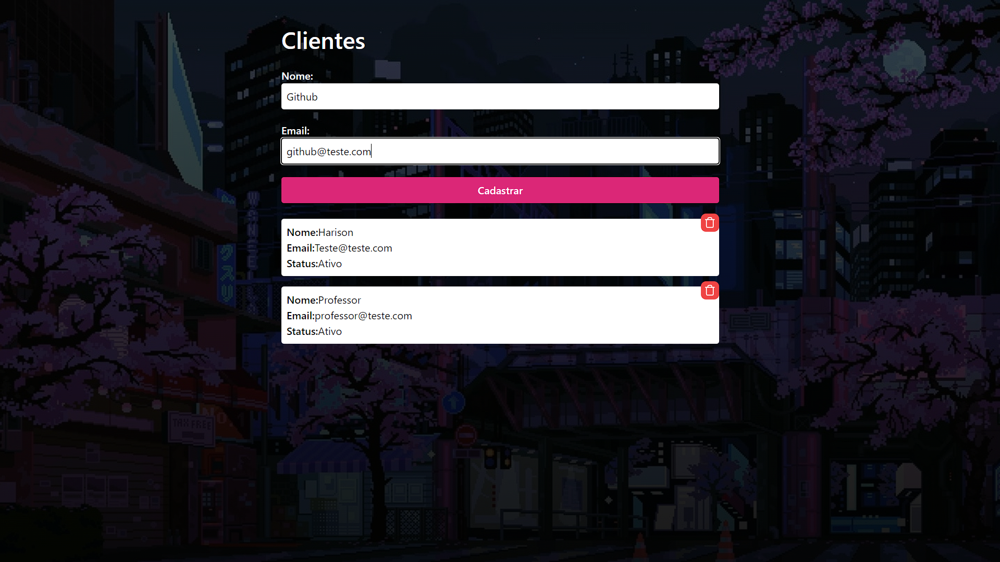
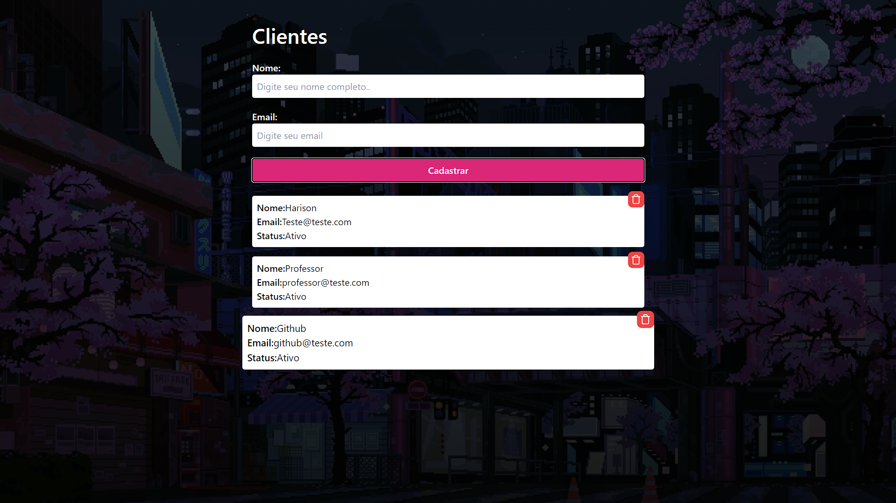

# API  - Harison 

> Imagem principal

> Imagem cadastro

> Imagem pos-cadastro

## Tecnologias

        
 
 
## 📝 Licença

Esse projeto está sob licença. Veja o arquivo [LICENÇA](LICENSE.md) para mais detalhes.
